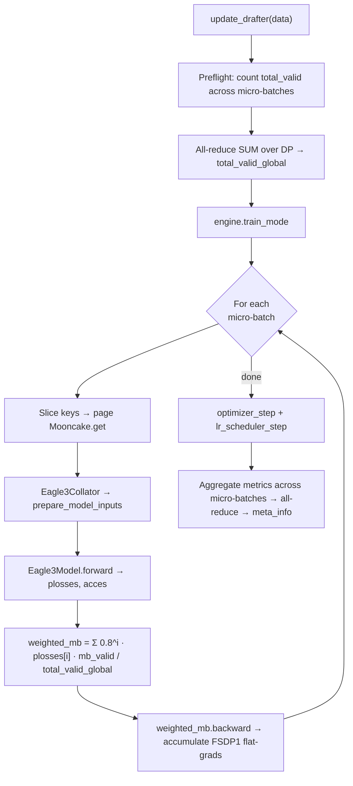

# Drafter Micro-Batching Refactor Plan

> [!summary] TL;DR
> The drafter is FSDP1 today, but **FSDP2 is the right destination** — TorchSpec uses FSDP2 (selective wrap of only `midlayer` Linears) and speculators uses FSDP2 (per-block `fully_shard`). The grad-size mismatch encountered when adding micro-batching is **not** an FSDP-version bug — it's a `torch.compile` graph stability bug in the `LazyTarget` loss path, orthogonal to FSDP1 vs FSDP2. Order of work: (a) fix the kernel (drop `_from_hs`, use `PrecomputedTarget` with bf16 storage), (b) migrate to FSDP2 with TorchSpec-style selective wrap so `lm_head`/`norm` stay in the root unit (not their own FSDP sub-units), (c) restructure `update_drafter` into a paged-Mooncake-fetch + accumulate loop mirroring verl's canonical `forward_backward_batch` divisor pattern.

> [!info] Source files
> All paths are relative to the verl working directory.
> - Engine: `recipe/drafter_cotraining/drafter_engine.py`
> - Worker: `recipe/drafter_cotraining/fsdp_workers.py` (renamed to `engine_workers.py` in Phase E)
> - Eagle3 model: `recipe/drafter_cotraining/eagle3/eagle3_model.py`
> - Loss kernel: `recipe/drafter_cotraining/eagle3/ops/loss.py`
> - Config: `recipe/drafter_cotraining/config/drafter_ct_trainer.yaml`
> - Verl FSDP reference: `verl/workers/engine/fsdp/transformer_impl.py`
> - Verl micro-batch utils: `verl/workers/engine/utils.py`
> - **Reference libraries (local clones):** `ref/TorchSpec/` (TorchSpec). When `ref/speculators/` is added later, references to speculators below should be reread from there. All TorchSpec line references in this doc point to `ref/TorchSpec/torchspec/...`.

---

## 1. What the drafter's "FSDP wrapping" actually is today

Confirmed from code + config:

- `drafter_engine.py:167` — `FSDPDrafterEngine` registers itself for **both** `["fsdp", "fsdp2"]` backends, but it inherits the parent's `_build_fsdp_module` (`transformer_impl.py:325`). The actual wrap path is dispatched by `engine_config.strategy`.
- `drafter_ct_trainer.yaml:180` — pins `strategy: fsdp` with `use_orig_params: True`. **It is FSDP1.**
- The original reasoning in drafter-design.md:212-227 was:
  1. Mixed `requires_grad` across the wrap group (frozen `embed_tokens` + trainable `fc/midlayer/norm/lm_head`) → FSDP1's default `use_orig_params=False` would reject this; `True` lifts the restriction.
  2. Plain `nn.Parameter` instead of `DTensor` → the compiled loss kernel's `F.linear(plain_input, draft_lm_head_weight)` doesn't trip the "Tensor × DTensor" runtime error you'd hit under FSDP2.
- **Reason 1 is real but FSDP2 doesn't have this restriction** (FSDP2 always uses orig-params semantics). **Reason 2 is overstated** — see §1b.

> [!warning] Subtle gotcha — the FSDP2 hooks in `_build_module` are dead code under the current config
> `_build_module` sets `module._no_split_modules = ["LlamaDecoderLayer"]` (drafter_engine.py:242) and `module.config = draft_model.config` (line 245), but those are **only read by the FSDP2 wrap path** (`apply_fsdp2`). Under `strategy: fsdp`, the wrap policy comes from `engine_config.wrap_policy` via `get_fsdp_wrap_policy` (`transformer_impl.py:343`). For our tiny draft, the size-based default likely wraps nothing → the model collapses to a single root FSDP unit. That's actually fine: <1 GB bf16, one all-gather per forward.

> [!info] `_target_lm_head_weight` and `_verifier_norm` are deliberately outside the FSDP wrap
> drafter_engine.py:303-309 stores them as engine-owned plain tensors, not as buffers on the wrapped module. The compile graph sees them as fixed plain tensors — no DTensor, no FSDP shard mutation across micro-batches. This is correct under either FSDP version.

So the current code is FSDP1 by config, but FSDP2 was misjudged as incompatible with the loss kernel. Read on for the corrected analysis.

---

## 1b. Why the "FSDP2 breaks the loss kernel" claim is wrong

### What the references actually do

> [!example] TorchSpec — selective wrap of only `midlayer` Linears
> `ref/TorchSpec/torchspec/training/eagle3_trainer.py:100-111`:
> ```python
> midlayer_modules = [
>     m for name, m in eagle3_model.named_modules()
>     if isinstance(m, torch.nn.Linear) and "midlayer" in name
> ]
> eagle3_model = apply_fsdp2(
>     eagle3_model, mesh=self.dp_mesh,
>     modules_to_shard=midlayer_modules,
> )
> ```
> And `ref/TorchSpec/torchspec/training/fsdp.py:137-200`:
> ```python
> def apply_fsdp2(model, mesh, ..., modules_to_shard=None):
>     strategy = getattr(args, "fsdp_strategy", "REPLICATE").upper()
>     if strategy == "REPLICATE":          # ← default
>         replicate(model, device_mesh=mesh)   # DDP-like, no shard
>         return model
>     elif strategy == "FULL_SHARD":
>         for module in modules_to_shard or []:
>             fully_shard(module, **fsdp_kwargs)
>         fully_shard(model, **fsdp_kwargs)        # root wrap
>         return model
> ```
>
> Two things to notice:
> 1. **TorchSpec's default is `replicate` (DDP-style), not FSDP2 sharding.** drafter-design.md mentioned this in passing but didn't draw the right conclusion.
> 2. **When opted into `FULL_SHARD`, only the Linear layers *inside* `midlayer` get their own FSDP unit.** `lm_head`, `norm`, `fc`, `embed_tokens` are not in `modules_to_shard` — they fall under the root `fully_shard(model)` wrap.

> [!example] Speculators — per-block `fully_shard` + root wrap
> `speculators/src/speculators/train/utils.py`:
> ```python
> for layer in model.layers:
>     fully_shard(layer, mp_policy=mp_policy)
> fully_shard(model)
> ```
> Every decoder block becomes its own FSDP unit. `lm_head` and `norm` fall under the root wrap. See [[FSDP Sharding in Speculators]].
>
> Speculators' loss is `F.kl_div(log_softmax(logits), softmax(targets))` — it doesn't extract `lm_head.weight` and pass it to a compiled function. Instead it calls `lm_head(norm(hidden_states))` as a module chain, so FSDP2's pre-forward hooks fire and the params are gathered before the matmul.

### So what's actually true under FSDP2?

When `Eagle3Model.forward` runs, the **root** `fully_shard(model)` pre-forward hook all-gathers all params in the root unit (which includes `lm_head`, `norm`, `fc`). After the gather, `param.data` points at the full unsharded tensor. `F.linear(activation, param)` then does the right thing — the param is treated as a plain tensor for compute purposes.

The "Tensor × DTensor doesn't auto-promote" failure mode only fires when:
- A param is in **its own separately-`fully_shard`'d sub-unit**, AND
- The param is **extracted as a tensor argument** outside that sub-unit's forward (so its hook never fires), AND
- The extracted weight is then matmul'd against a plain Tensor activation.

Verl's default `apply_fsdp2` (`fsdp_utils.py:534-561`, via `_select_fsdp2_wrap_targets:510`) wraps `embed_tokens` and `lm_head` as their **own** FSDP units (unless `tie_word_embeddings=True`), in addition to transformer layers + root. That's correct sizing for an actor-scale LM but wrong for our drafter — it produces exactly the failure mode above when the compiled kernel reads `lm_head.weight`.

> [!success] The fix is to mirror TorchSpec's selectivity
> Shard **only** `LlamaDecoderLayer` inside the drafter; let `lm_head`/`norm`/`fc`/`embed_tokens` fall under the root wrap. The kernel's `F.linear(plain_input, lm_head_weight)` then works because the root pre-forward hook has already gathered `lm_head.weight` before `_calculate_loss` reads it.

---

## 2. Path from FSDP wrap → torch.compile kernels — current vs target

> [!example] Current (FSDP1 + LazyTarget — what's deployed today)
> ```
> FSDPDrafterEngine.module
>   = FSDP1(use_orig_params=True)(Eagle3Model)
>                                  │
>                                  └─ length=7 TTT loop in Eagle3Model.forward()
>                                       └─ for idx in range(7):
>                                             backbone(...) ──→ draft_hs
>                                             _calculate_loss(draft_hs, target, mask, idx, …)
>                                                                           │
>                                                                           ▼
>                                                         eagle3/ops/loss.py
>                                                           @torch.compile compiled_forward_kl_loss_from_hs
>                                                             ├─ index_select(0, valid_idx)        # ← N_valid varies
>                                                             ├─ F.linear(ths, target_lm_head_weight)  # full-vocab matmul
>                                                             ├─ softmax (fp32, materializes (N, V_full))
>                                                             ├─ RMSNorm + draft lm_head matmul
>                                                             └─ -(tp * log_p).sum(-1).mean()
> ```
> Two cross-layer hazards: (1) `target_lm_head_weight` flows into the compile graph as a tensor argument; (2) `mark_dynamic(valid_idx, 0)` covers only the gather index — downstream `(N, V_full)` / `(N, V_draft)` shapes drift across micro-batches.

> [!success] Target (FSDP2 selective wrap + PrecomputedTarget — what we're building)
> ```
> FSDPDrafterEngine.module
>   = fully_shard(Eagle3Model)                          ← root: PyTorch auto-keeps gathered
>     └─ fully_shard(LlamaDecoderLayer)                 ← midlayer: gathers per fwd, reshards (default)
>                                  │
>                                  └─ length=7 TTT loop in Eagle3Model.forward()
>                                       └─ for idx in range(7):
>                                             backbone(...) ──→ draft_hs
>                                             _calculate_loss(draft_hs, target_p, mask, idx, …)
>                                                                           │
>                                                                           ▼
>                                                         eagle3/ops/loss.py
>                                                           @torch.compile compiled_forward_kl_loss
>                                                             ├─ index_select(0, valid_idx)
>                                                             ├─ RMSNorm + draft lm_head matmul   ← uses gathered lm_head.weight
>                                                             └─ -(target_p * log_p).sum(-1).mean()
> ```
> `target_p` is built outside the compile graph (in `prepare_model_inputs` via `compute_target_p_padded`). The compiled kernel sees only fixed-shape inputs (`(B*T_pad, ...)`) plus a dynamic `valid_idx`. `lm_head.weight` is gathered once at root forward entry and stays gathered through all 7 TTT steps + backward.

---

## 3. Why naive micro-batching produced a gradient size mismatch

> [!info] Read this section as "what's broken today, that the refactor fixes". Step 1 (drop LazyTarget) makes reasons 1-3 moot. Reason 4 stays relevant under any path; Step 4 of the refactor handles it.

Not a wrap-policy bug — a `torch.compile` graph stability bug. See [[LazyTarget vs Precomputed Memory Analysis]] for the canonical writeup. Three structural reasons compound, plus a fourth around the empty-mask fallback:

> [!danger] Reason 1 — `target_lm_head_weight` lives inside the compile graph
> If any reference (intentional or not) carries `requires_grad=True` lineage, or if you ever switch to FSDP2 and it becomes a `DTensor`, the compiled function treats it as a graph input needing grad tracking across micro-batches. After the first backward, FSDP's reduce-scatter has changed the effective shape; the second micro-batch's backward sees a mismatch.

> [!danger] Reason 2 — Two `valid_idx`-dependent matmuls per call, only one dim marked dynamic
> `mark_dynamic` covers `valid_idx` itself. The downstream `(N, V_full)` softmax tensor and `(N, V_draft)` logits tensor have shapes that move with `N_valid` per micro-batch. The compiler may pin one and either recompile or error on the next.

> [!danger] Reason 3 — Target softmax inside the autograd graph
> `torch.compile` doesn't always honor `requires_grad=False` without an explicit `.detach()` *inside* the compiled region. In `compiled_forward_kl_loss_from_hs` (loss.py:91) `target_lm_head_weight` isn't detached.

> [!warning] Reason 4 — empty-mask fallback (eagle3_model.py:107-113)
> When `valid_idx.numel() == 0`, the code synthesizes a "zero loss" by `sum(p.reshape(-1)[0] for p in self.parameters() if p.requires_grad) * 0.0`. Under micro-batching, if some micro-batches hit this path and others don't, FSDP1 will still all-reduce a "all params touched" graph for the zero-batch — producing an unbalanced grad accumulation. Not a shape mismatch per se, but a divisor problem that lights up the same way.

---

## 4. How the references handle this shape

| | What they do | Reusable for us? |
|---|---|---|
| **TorchSpec** | Explicit `for batch in micro_batches: loss = forward(batch); (loss/accum).backward()` then one `optimizer.step()`. Uses `PrecomputedTarget` (full-vocab, eagerly builds `(B, T+length, V_draft)` outside the compiled region). FSDP2 (`apply_fsdp2`) on `midlayer` modules. | **Yes** — this is the shape we want. Stability comes from precomputed-target + outside-the-compile-region target build. |
| **Speculators** | No explicit micro-batching at all (verified: `trainer.py:184-229` does one forward / backward / step per dataloader batch — no accumulation paths anywhere in the repo). FSDP2 (`fully_shard`) per-layer + root, bf16-master / fp32-reduce. Loss uses `F.kl_div`, full forward is `@conditional_torch_compile`'d. See [[FSDP Sharding in Speculators]]. | **Validates FSDP2 wrap shape only** — they show that `fully_shard(layer)` per decoder block + `fully_shard(model)` root is a working FSDP2 pattern with the same Eagle3 architecture. They *don't* validate accumulation; for that we follow TorchSpec + verl. |
| **Verl `FSDPEngine`** (`transformer_impl.py:591-621`) | Canonical `forward_backward_batch`: all-reduces `data["loss_mask"].sum()` across DP first to get a global token count, calls `prepare_micro_batches`, then a plain `for micro_batch: loss, meta = forward_step(...); loss.backward()` loop with **no `no_sync`**. Each micro-batch's loss is normalized by the global token count, so summing N backwards = one backward. | **Yes** — this is the pattern to mirror. Pre-compute the global divisor, then normalize per micro-batch. |

> [!tip] The unifying insight
> The stable references all keep target construction *outside* the compile graph and use a *fixed* per-batch divisor pre-computed across DP. We currently do neither.

---

## 5. Refactor plan

### Goal

Add micro-batching to `update_drafter` in `recipe/drafter_cotraining/fsdp_workers.py` so that:

1. **Peak memory drops** — Mooncake `get()` is paged: only `micro_batch_size` samples' worth of `hidden_states + last_hidden_states + input_ids` are resident at once.
2. **Forward/backward is decomposed** — N micro-batches × (forward → 7-step TTT → weighted backward), then one `optimizer.step()`.
3. **Numerics match the current single-step path** — `loss_weighted` and `simulated_acc_len` curves overlap the existing 16-step smoke baseline within float noise.
4. **No grad-size mismatch** — compile graph is shape-stable across micro-batches.

### Design principles

- **Eliminate the LazyTarget compile-graph instability before adding accumulation**, not after. Trying to micro-batch on the current path will keep tripping reasons 1-3 above.
- **Mirror verl's `forward_backward_batch` divisor pattern**: pre-compute total valid positions across all micro-batches once, normalize each per-step loss by that, then sum.
- **Page Mooncake fetches with a 1-deep prefetch** — overlap fetch-i+1 with forward-i. Don't go fancier; HS-collector + drafter share the GPU and contention isn't the bottleneck.
- **Migrate to FSDP2 with TorchSpec-style selective wrap** (only `LlamaDecoderLayer`). Verl's default `apply_fsdp2` over-shards `lm_head`/`embed_tokens` for our case; an `FSDPDrafterEngine._build_fsdp_module` override fixes it cleanly. See §5b.



### Step 1 — Stabilize the loss kernel (prerequisite)

This is the hardest call to make and the highest-leverage. Two viable directions:

> [!example] Option A (recommended): drop LazyTarget, switch to PrecomputedTarget with bf16 storage
> Matches the recommendation in [[LazyTarget vs Precomputed Memory Analysis]].
>
> - For Qwen3-4B (`V=151,936`, `T_pad ≤ 4352`, `length=7`), `(1, T_pad+7, V_full)` in bf16 ≈ **1.3 GB per sample** resident. With `micro_batch_size=1` (the planned mode), this fits comfortably.
> - Edit `eagle3_model.py:286-288` to store `target_p` as bf16:
>   ```python
>   target_p = F.softmax(target_logits_pruned.float(), dim=-1).to(torch.bfloat16)
>   ```
>   The compiled kernel's `tp * log_p` (with `log_p` fp32) auto-upcasts `tp`, so loss arithmetic stays fp32.
> - Generalize `compute_target_p_padded` to handle the no-pruning case (compute `target_p` over full vocab, skip the `t2d` / `position_mask` machinery).
> - Drop the `LazyTarget` branch in `_calculate_loss`; collapse to a single `compiled_forward_kl_loss` path.
> - Delete `compiled_forward_kl_loss_from_hs`, `LazyTarget`, `compute_lazy_target_padded`, `_target_lm_head_weight` plumbing.

> [!example]- Option B (deferred, more risk): keep LazyTarget but harden it
> - Wrap `target_lm_head_weight` in an explicit `.detach()` *inside* the compiled function.
> - `mark_dynamic(target_logits_flat, 0)` on the intermediate `(N, V_full)` tensor.
> - Pad `valid_idx` to a fixed length (`T_pad * B_micro`) per micro-batch with sentinel values that contribute zero to the loss.
> - Risk: still fragile to `torch.compile` version drift; the memory-analysis note recommends deletion.

> [!success] Recommendation: Option A
> The crossover analysis (mask density `ρ` vs winner table in [[LazyTarget vs Precomputed Memory Analysis]]) shows lazy only "wins" at `ρ < 0.25` *and only without micro-batching*; we want micro-batching, so precomputed is strictly dominant.

If you want to keep one safety hedge: gate behind a config flag (`drafter.eagle3.use_lazy_target: false` default, `true` for ρ-extreme experiments without micro-batching).

### Step 1b — Migrate to FSDP2 with selective wrap

Drop into `FSDPDrafterEngine` an override of `_build_fsdp_module` that mirrors TorchSpec exactly: shard only `LlamaDecoderLayer`, let everything else fall into the root unit. We pass identical `fsdp_kwargs` to both calls — same as TorchSpec (`ref/TorchSpec/torchspec/training/fsdp.py:187-199`). PyTorch's `fully_shard` auto-detects the root and handles the "stay gathered through backward" property internally; we don't need to override `reshard_after_forward`.

```python
# in FSDPDrafterEngine
def _build_fsdp_module(self, module):
    from torch.distributed.fsdp import (
        CPUOffloadPolicy, MixedPrecisionPolicy, fully_shard,
    )
    from verl.utils.fsdp_utils import fsdp2_load_full_state_dict

    mp_policy = MixedPrecisionPolicy(
        param_dtype=torch.bfloat16,
        reduce_dtype=torch.float32,
        cast_forward_inputs=True,   # benign — only casts FSDP2 pre-forward inputs;
                                    # does NOT override the kernel's manual fp32 RMSNorm.
    )
    offload = CPUOffloadPolicy(pin_memory=True) if self.engine_config.offload_policy else None

    fsdp_kwargs = {
        "mesh": self.device_mesh,
        "mp_policy": mp_policy,
        "offload_policy": offload,
    }

    # ① Capture full state PRE-WRAP — fsdp2_load_full_state_dict needs this so
    #    broadcast_from_rank0 can populate every rank's sharded DTensor correctly.
    full_state = module.state_dict()

    # ② Shard ONLY the LlamaDecoderLayer (the midlayer — bulk of trainable params).
    #    Sub-units default to reshard_after_forward=True: gathered during this
    #    module's forward, freed afterward. This is the actual memory saving.
    for name, sub in module.named_modules():
        if sub.__class__.__name__ == "LlamaDecoderLayer":
            fully_shard(sub, **fsdp_kwargs)

    # ③ Wrap the root. fully_shard auto-detects "this is the root" and forces
    #    its effective reshard_after_forward to False, so root params (lm_head,
    #    norm, fc, embed_tokens) stay gathered across forward → backward.
    #    Exactly what the compiled loss kernel needs.
    fully_shard(module, **fsdp_kwargs)

    # ④ Broadcast full state from rank 0. rank 0 has populated full_state;
    #    other ranks have empty dicts; broadcast_from_rank0=True makes this
    #    a collective that lands the correct shard on each rank.
    fsdp2_load_full_state_dict(module, full_state, self.device_mesh, offload)
    return module
```

Config flip in `drafter_ct_trainer.yaml`:

```yaml
drafter:
  engine_config:
    strategy: fsdp2              # was: fsdp
    # use_orig_params is FSDP1-only — drop it. FSDP2 always behaves orig-params-like.
    fsdp_size: -1
    param_offload: False
    optimizer_offload: False
```

> [!info] Why we don't pass `reshard_after_forward` at all
> PyTorch's `fully_shard` auto-detects the root unit and forces its effective `reshard_after_forward` to `False` regardless of what you pass. The docstring is on `verl/utils/fsdp_utils.py:734-766` (`set_reshard_after_forward`, copied verbatim from PyTorch) — it explicitly says "the FSDP root module's value … is otherwise specially set to `False`". TorchSpec exploits this (`ref/TorchSpec/torchspec/training/fsdp.py:187-199` passes identical `fsdp_kwargs` to sub-units and root, omitting `reshard_after_forward`). Mirroring TorchSpec gives us:
> - **midlayer (sub-unit):** default `True` → gathered for its forward, resharded after — the actual memory saving.
> - **root (auto-detected):** effectively `False` → params stay gathered across forward → backward — what the compiled kernel needs.
>
> Earlier drafts of this plan called `reshard_after_forward=False` on root "non-negotiable" and explicit. Both were over-engineering — PyTorch handles it for free.

> [!info] Why we override instead of extending verl's `apply_fsdp2`
> Verl's `_select_fsdp2_wrap_targets` (`fsdp_utils.py:510-531`) wraps `embed_tokens`/`lm_head` *as their own FSDP units* unless `tie_word_embeddings=True`. That's right for a 7B actor where `lm_head` is ~525MB. For a tiny draft, separately wrapping `lm_head` triggers the "Tensor × DTensor" failure when the compiled kernel reads `lm_head.weight` (the sub-unit's pre-forward hook never fires because we never call `self.lm_head(...)` as a module — we extract `.weight` directly). A drafter-local override keeps the change scoped to `recipe/drafter_cotraining/` per the recipe-first rule.

> [!info] What `cast_forward_inputs=True` actually does
> It casts FSDP2's pre-forward input activations to `param_dtype` (bf16). It does **not** override your kernel's manual `hs_f32 = hs.float()` in `compiled_forward_kl_loss` (loss.py:51). Safe to keep at default `True`.

> [!info] What stays the same — verl already handles these correctly under partial wrap
> - **`fsdp2_clip_grad_norm_`** (`transformer_impl.py:644`) handles mixed DTensor (midlayer) + plain-tensor (root unit's gathered) grads via PyTorch's `_get_total_norm` / `_clip_grads_with_norm_`. No change.
> - **`build_optimizer(module.parameters(), ...)`** works transparently — `torch.optim.AdamW` is opaque to DTensor wrappers; optimizer state lives in plain tensors keyed by param. No change.
> - **`get_per_tensor_param`** (`transformer_impl.py:748-820`) calls `.full_tensor()` on DTensor params and passes plain tensors through (line 791-793). Works for partial wrap; needed for drafter→rollout weight sync.
> - **`get_fsdp_full_state_dict`** (`fsdp_utils.py:418-451`) uses `get_model_state_dict(..., full_state_dict=True, broadcast_from_rank0=True)`, which walks the module tree and reconstructs full state on rank 0. Works for partial wrap. Used by drafter's `save_checkpoint` HF export (drafter_engine.py:382).
> - **`eval_mode` forward on DTensor params**. Speculators' `val_epoch` (`trainer.py:231-267`) runs forward on the FSDP2-wrapped model with just `model.eval()` + `@torch.no_grad()` — no `summon_full_params` / `unshard`. Validates that `_drafter_eval_step` (`fsdp_workers.py:370-392`) works as-is post-migration.

> [!warning] Defensive fallback if the compiled kernel rejects a DTensor weight
> Under modern PyTorch (2.4+), the compiled kernel's `F.linear(activation_tensor, lm_head_weight)` should work with `lm_head_weight` either as a plain Tensor or as a Replicate-DTensor (the all-gathered state under `reshard_after_forward=False`). TorchSpec runs this exact pattern successfully (`compiled_forward_kl_loss` is the same kernel we use, on FSDP2-wrapped Eagle3Model). If you ever hit a "Tensor × DTensor" runtime error under our override, the escape hatch is to extract a plain tensor in `Eagle3Model._calculate_loss` before invoking the compiled kernel:
> ```python
> norm_weight, lm_head_weight, norm_eps = self.draft_model.get_lm_head_params()
> if isinstance(lm_head_weight, torch.distributed.tensor.DTensor):
>     lm_head_weight = lm_head_weight.full_tensor()  # explicit gather to plain Tensor
>     norm_weight = norm_weight.full_tensor() if isinstance(norm_weight, DTensor) else norm_weight
> ```
> Don't add this preemptively — only if a real failure surfaces. Adds an unnecessary all-gather otherwise.

> [!note] Why we don't follow speculators' "compile the whole forward" approach
> Speculators uses `@conditional_torch_compile` on the whole `Eagle3DraftModel.forward` (`core.py:149-153, 265`). Our compile boundary is the loss kernel only. Their broader compile is fine for them because their loss is `F.kl_div(..., reduction="none")` (no raw-weight kernel arg) — the whole compiled graph never sees an extracted `lm_head.weight`. Ours does, which is exactly why we rely on PyTorch's auto root-no-reshard for `lm_head.weight` to be valid across the forward → backward boundary. Don't expand the compile boundary.

> [!tip] Cleanup post-migration
> - Delete `module._no_split_modules = ["LlamaDecoderLayer"]` and `module.config = draft_model.config` from `_build_module` (drafter_engine.py:242, 245) — both were FSDP2-default-wrap hooks that the override bypasses.
> - Remove `use_orig_params: True` from the YAML.
> - The per-rank `draft_model.load_embedding(target_path, ...)` in `_build_module:225` becomes redundant once `fsdp2_load_full_state_dict` broadcasts from rank 0. Safe to leave for now (cheap; tiny embedding); simplify to `if rank == 0: ...` later if init memory matters.
> - Update drafter-design.md §"Engine choice — FSDP1 with `use_orig_params=True`" to reflect the FSDP2 selective-wrap design (TorchSpec-style: shard only `LlamaDecoderLayer`, root holds `lm_head`/`norm`/`fc`).

> [!warning] Checkpoint compatibility — start fresh
> FSDP1 sharded checkpoints (FlatParameter layout) are **not** loadable by FSDP2 (DTensor layout). The drafter checkpoints today are smoke-only (commits up through 2026-04-26 baseline), so this isn't a blocker — just be aware that any pre-migration checkpoint won't resume cleanly post-migration. New runs after the FSDP2 flip start fresh. If you need a one-time conversion later, `get_fsdp_full_state_dict(...)` on the FSDP1 model produces a plain-tensor full state dict that `fsdp2_load_full_state_dict(...)` can re-shard onto FSDP2.

### Step 1c — Mirror TorchSpec's empty-mask filter at fetch time

TorchSpec's `data_fetcher.py:160-166` drops any sample whose loss mask is all zero **before** it ever reaches the training loop:

```python
if self._compute_loss_mask(data) is None:
    skip_count += 1
    logger.warning("Skipping sample with all-zero loss mask ...")
    continue
```

Our `_fetch_drafter_batch_from_mooncake` (fsdp_workers.py:248-311) already drops samples with `rlen <= 1` (degraded fallback to all-ones mask), but doesn't filter "real" samples whose mask happens to sum to zero. The filter can be done **purely on metadata** — the loss-mask formula `mask[plen : plen + rlen - 1] = 1` means a sample contributes `max(0, rlen - 1)` valid positions. Apply this filter in `update_drafter` *before* even calling the Mooncake-fetch path, so we don't pay for `store.get()` on a sample that contributes nothing:

```python
# in update_drafter, before the micro-batch loop
keep_mask = [int(r) - 1 > 0 for r in data.non_tensor_batch.get("response_lens", [])]
if not all(keep_mask):
    n_dropped = sum(1 for k in keep_mask if not k)
    logger.warning("[drafter] dropping %d samples with zero loss-mask positions", n_dropped)
    data = self._select_data_indices(data, [i for i, k in enumerate(keep_mask) if k])

    # Free the dropped Mooncake keys eagerly so the producer can reuse the buffers.
    store = self._get_mooncake_store(data.meta_info.get("mooncake_cfg", {}), rank)
    if store is not None:
        for i, k in enumerate(keep_mask):
            if not k:
                store.remove_eagle3_tensors(
                    key=str(orig_keys[i]),
                    has_last_hidden_states=True,
                )
```

This is purely a hygiene fix — it doesn't replace the in-kernel `valid_idx.numel() == 0` fallback in `eagle3_model.py:107-113`, which stays as-is (it's FSDP-grad-sync insurance, mirroring TorchSpec's `eagle3.py:89-95` exactly).

> [!info] Why both layers are needed
> The fetch-time filter saves wasted forward+backward on a sample that contributes nothing. The in-kernel fallback is a per-rank safety net: if a TTT step's *shifted* `loss_mask` (after `padding(left=False)`) becomes all-zero on one rank but not another, the kernel still produces a grad graph touching every param, so FSDP's reduce-scatter doesn't deadlock. Keep both.

### Step 2 — Restructure `update_drafter` into a micro-batched loop

All changes contained to `recipe/drafter_cotraining/fsdp_workers.py`. Two key properties to lock in:

1. **The whole macro-step lives in one Ray RPC call.** Because `update_drafter` is the RPC handler, all micro-batches accumulate within this call before `optimizer.step()` fires. Gradients implicitly persist across micro-batches (PyTorch's `.backward()` accumulates into `.grad`); we never zero between them. This matches TorchSpec's `_train_core_from_queue` (`trainer.py:279-342`) shape exactly, just delivered via RPC instead of a persistent loop.
2. **`engine.train_mode()` zeroes grads on context exit** (`transformer_impl.py:864-868`). So we don't need a manual `optimizer_zero_grad()` — the context handles it. Just keep the entire accumulation + `optimizer_step` + `lr_scheduler_step` inside one `with engine.train_mode():` block.

```python
@register(dispatch_mode=make_nd_compute_dataproto_dispatch_fn(mesh_name="drafter"))
def update_drafter(self, data: DataProto):
    # … existing key/shape/dtype unpack from non_tensor_batch …
    keys = data.non_tensor_batch["mooncake_keys"]
    if len(keys) == 0:
        return DataProto(non_tensor_batch={})

    micro_size = int(self.config.drafter.get("micro_batch_size_per_gpu", 1))
    accum = math.ceil(len(keys) / micro_size)

    # ① Preflight: compute total valid positions across all micro-batches PURELY
    #    FROM METADATA — no tensor fetch needed. The per-sample loss-mask formula
    #    (fsdp_workers.py:287-291) is `mask[plen : plen + rlen - 1] = 1`, so each
    #    sample contributes `max(0, rlen - 1)` valid positions. This is already
    #    in non_tensor_batch.
    prompt_lens  = data.non_tensor_batch.get("prompt_lens", [])
    response_lens = data.non_tensor_batch.get("response_lens", [])
    total_valid = sum(max(0, int(r) - 1) for r in response_lens)
    total_valid_global = _allreduce_sum_int(total_valid, dp_group)

    # ② Engine context — single train_mode wraps the whole accumulation step.
    engine = self.drafter.engine
    accum_metrics = []
    with engine.train_mode():
        for mb_idx, mb_data in enumerate(self._iter_micro_batches(data, micro_size)):
            mb = self._fetch_drafter_batch_from_mooncake(mb_data, rank)  # paged Mooncake.get
            mb_metrics = self._drafter_micro_step(
                mb,
                rank=rank,
                total_valid_global=total_valid_global,
                last=(mb_idx == accum - 1),
            )
            accum_metrics.append(mb_metrics)

        grad_norm = engine.optimizer_step()
        lr = engine.lr_scheduler_step()

    # ③ Aggregate per-micro-batch metrics into the same dict shape today's smoke expects.
    metrics = self._aggregate_micro_metrics(accum_metrics, grad_norm, lr, rank)
    return DataProto(non_tensor_batch=data.non_tensor_batch, meta_info={"train_metrics": metrics})
```

`_drafter_micro_step` is the per-micro-batch worker:

```python
def _drafter_micro_step(self, mb, rank, total_valid_global, last):
    engine = self.drafter.engine
    prepared = engine.prepare_model_inputs(mb_to_device(mb))   # PrecomputedTarget built here
    plosses, _, acces = engine.module(**prepared)              # 7-step TTT

    # Normalize so summing all micro-batches = one macro-batch backward.
    # plosses[i] is a *mean* today (loss.py:60). To make it sum-poolable, multiply
    # by this micro-batch's valid_count and divide by total_valid_global at the end.
    mb_valid = prepared["loss_mask"].sum().detach()
    weighted = sum(
        (0.8 ** i) * p * (mb_valid / total_valid_global)
        for i, p in enumerate(plosses)
    )
    weighted.backward()  # accumulates into the (now FSDP2-DTensor) param grads

    return {
        "plosses": [p.detach() for p in plosses],
        "acces": [a.detach() for a in acces],
        "mb_valid": int(mb_valid.item()),
    }
```

> [!info] Why this divisor instead of TorchSpec's `/ accumulation_steps`
> TorchSpec's `_backward` (`eagle3_trainer.py:264-268`) does:
> ```python
> ploss = sum(ploss_weight[i] * plosses[i] for i in range(len(plosses))) / accumulation_steps
> ```
> i.e. divide by the *number* of micro-batches. That's only equivalent to a single-batch loss if each micro-batch has the same `N_valid`. In practice `N_valid` varies across samples (different prompt/response splits), so the TorchSpec form is approximate.
>
> Our `mb_valid / total_valid_global` weighting recovers the exact single-batch semantics: `Σ_k (mb_valid_k / total_valid_global) · loss_k = (1 / total_valid_global) · Σ_k Σ_pos per_pos_loss = mean over total valid positions`. This matches what the existing single-batch path computes today, so the verification baseline (12.0811 → 7.6583 over 16 steps) reproduces exactly. It also mirrors verl's canonical `forward_backward_batch` divisor pattern (`transformer_impl.py:596-600`).

> [!tip] Why this keeps shapes stable
> - Each micro-batch is its own fresh forward + 7-step TTT loop. `valid_idx` is recomputed per step within the compiled kernel — `mark_dynamic` on dim 0 was already there (eagle3_model.py:115).
> - The compiled kernel doesn't see `target_lm_head_weight` anymore (precomputed path uses `target_p` only). One fewer dynamic-shape input.
> - `T_pad` is snapped to a multiple of 256 by `Eagle3Collator`, so per-micro-batch shape variance is bucketed into a small finite set.

> [!warning] `T_pad` jitter across micro-batches → `torch.compile` recompilation
> If micro-batch A pads to `T_pad=512` and micro-batch B pads to `T_pad=768`, the compiled kernel may recompile once for each new bucket size it sees. After a few macro-steps the cache is warm, but cold-start has a recompilation tax. Two mitigations:
> 1. **Easy:** snap `T_pad` to the **macro-batch maximum** before micro-batching, not per-micro-batch. Pre-walk samples in `update_drafter`, find `T_pad_macro = ceil(max(seq_len), 256)`, then pass that into the collator for every micro-batch. All micro-batches in one macro-step have identical `T_pad`. Only inter-macro-step jitter remains, which is bounded.
> 2. **Harder:** `torch._dynamo.mark_dynamic` on the `B*T_pad` dim of `prenorm_hidden_states_flat`/`target_p_flat` inside the compiled kernel. Lets the compiler treat that dim as fully dynamic. Risk: dynamic shapes interact poorly with the index_select fusion. Skip in v1.

> [!info] Memory hygiene between micro-batches
> After `weighted.backward()`, autograd releases activations. But the local-frame references to the prepared inputs (`hidden_states`, `last_hidden_states`, `target_p_padded`) are still held. Add explicit cleanup at the bottom of `_drafter_micro_step`:
> ```python
> del prepared, plosses, acces, weighted, mb_valid
> # Optional: torch.cuda.empty_cache() once per macro-step in the outer loop
> ```
> The `target_p_padded` tensor is the heavy one (`~1.3 GB` per Qwen3-4B sample at `T=4096`); explicit `del` ensures it's freed before fetching the next micro-batch.

### Step 3 — Paged Mooncake fetch with 1-deep prefetch

> [!quote] Today
> `_fetch_drafter_batch_from_mooncake` walks **all** keys in one shot, calling `store.get()` per key, building the full collator input list, then collator pads everything to one mega-batch's `T_pad`. Peak resident memory ≈ `B_macro × T_pad × (3·D + D + 1) × 2 B`.

> [!quote] After
> Replace the single-shot fetch with a generator that fetches one micro-batch's worth of keys at a time. Each Mooncake `get()` is followed by `remove_eagle3_tensors()` for that key so the producer-side buffer is freed immediately.

```python
def _iter_micro_batches(self, data, micro_size):
    """Yield smaller DataProto-ish slices over Mooncake keys + metadata."""
    keys = data.non_tensor_batch["mooncake_keys"]
    for start in range(0, len(keys), micro_size):
        sl = slice(start, start + micro_size)
        yield self._slice_data(data, sl)
```

> [!success] Memory win
> `B_macro=8`, `micro_size=1`, `T_pad=4096`, `D=2560`, bf16 → drops the `hidden_states+last_hs` resident from ~1.3 GB to ~165 MB. The `target_p_padded` tensor (the new bf16-stored precomputed target) drops by the same factor since it's per-micro-batch.

> [!info]- Optional: 1-deep prefetch
> Launch the next micro-batch's `store.get()` on a CUDA stream while the current micro-batch's forward runs. **Skip in v1** — get correctness first, profile, then decide.

### Step 4 — Edge cases that bit us last time

> [!warning] Empty-mask micro-batch
> If a micro-batch has `valid_idx.numel() == 0` for *every* TTT step, the eagle3_model.py:107-113 fallback produces a fake loss touching every parameter. Under accumulation, that contributes zero to `weighted` (because `mb_valid == 0` → divisor is 0 → NaN). Fix: detect `mb_valid == 0` in `_drafter_micro_step` and **skip backward entirely** for that micro-batch.
>
> FSDP1 with `use_orig_params=True` tolerates skipped backwards as long as it happens **uniformly across DP ranks**. Decide skip-or-not on the **global `mb_valid`**, not the local one — extra small all-reduce per micro-batch.

> [!warning] Last-token-of-response loss-mask drop
> Already handled in `_fetch_drafter_batch_from_mooncake:287-292` (drops the final response position because there's no valid next-token target there). Preserve it in the per-micro-batch path.

> [!warning] `grad_norm` non-finite
> `engine.optimizer_step` (transformer_impl.py:632-665) already skips and zeros grads on non-finite. With accumulation, this means a NaN in any micro-batch wipes the whole macro-step — which is the correct semantics.

> [!warning] DP determinism
> `same_micro_num_in_dp=True` in verl's `prepare_micro_batches` ensures all ranks do the same number of micro-batches. Mirror this: pad the last DP rank's key list with no-op slots, or assert `len(keys)` is uniform — it should be, since `make_nd_compute_dataproto_dispatch_fn` gives even chunks.

### Step 5 — Small ergonomic changes

- Add `drafter.engine_config.micro_batch_size_per_gpu: int = 1` (default) to `drafter_ct_trainer.yaml`. Optional `drafter.engine_config.use_dynamic_bsz: false` knob for future dynamic packing.
- Surface `train/accumulation_steps` and `train/macro_valid` in the train metrics dict so the smoke run can verify accumulation actually fired.
- Update `claude_docs/drafter-design.md` "What's not built yet": micro-batching → done; remove the "Gradient accumulation > 1" follow-up bullet.

### Step 6 — Verification (run before claiming done)

> [!todo] Verification checklist
> 1. **Numerical baseline:** rerun `MAX_STEPS=16 ./scripts/run_drafter_training.sh` with `micro_batch_size_per_gpu=8` (= old single-shot path) and confirm `train/loss_weighted` curve matches the existing **12.0811 → 7.6583** baseline within ~`1e-3`.
> 2. **Micro-batch parity:** rerun with `micro_batch_size_per_gpu=1` (8 accumulation steps). The same loss curve should reproduce within float noise. Any divergence is a divisor or skip-mask bug.
> 3. **Memory:** add `log_gpu_memory_usage` calls around the micro-batch loop; expected peak with `micro_size=1` should be ~1/8 of the macro path's `hidden_states + target_p` resident.
> 4. **Determinism across ranks:** assert `total_valid_global` and the per-micro-batch skip decision agree across DP ranks (one `dist.all_reduce(torch.tensor([decision]))` + assert).

---

## 6. What I'd skip (YAGNI for now)

> [!quote] Don't bother — for now
> - **No-sync mode for all-but-last micro-batch.** FSDP1's `model.no_sync()` ctx mgr doesn't exist on FSDP2, and there is no equivalent public method (`set_requires_gradient_sync` is not a thing in current PyTorch FSDP2 nor in verl). Standard PyTorch micro-batch accumulation — accumulate grads via N backward passes, call `optimizer.step()` only on the last one — is what we do anyway. Each backward triggers FSDP2's reduce-scatter; for a <1 GB drafter on 2 GPUs the per-step overhead is microseconds. Don't optimize.
> - **Per-layer FSDP wrap of multiple decoder blocks.** The drafter has exactly **one** `LlamaDecoderLayer`; speculators' per-layer wrap (one block per FSDP unit) only buys memory for multi-block drafters. We get the same effect from the single class-name-matched `fully_shard(midlayer)` in §5b.
> - **`replicate` strategy (TorchSpec's default).** It's DDP-style — every rank carries the full ~140M parameter draft model + grads + optim state. For 2× H100 that's fine, but `fully_shard` of `midlayer` costs nothing extra and scales better as the drafter grows.

---

## 7. Order of work

> [!important] Sequencing matters
> 1. **Kernel fix** (FSDP-version-agnostic): drop `LazyTarget`; switch to bf16-stored `PrecomputedTarget`. Verify single-batch numerics still match the 12.0811 → 7.6583 baseline.
> 2. **FSDP2 migration**: override `_build_fsdp_module` per §5b; flip YAML to `strategy: fsdp2`; verify single-batch numerics still match.
> 3. **Micro-batching restructure**: paged Mooncake fetch + per-micro-batch divisor + uniform-across-DP empty-mask skip.
> 4. **Verification**: rerun the 16-step baseline at `micro_size=8` (single-shot equivalence) **and** `micro_size=1` (8-way accumulation). Both curves must overlap within float noise.
> 5. **Optional**: add 1-deep prefetch (Mooncake `get` for micro-batch i+1 overlapped with forward of micro-batch i).
>
> Steps 1 and 2 are independent and can be done in either order, but doing the kernel fix first lets you confirm your FSDP2 migration doesn't cause a regression *separately* from the kernel rewrite.

---

## 8. Concrete file-by-file change list

> [!todo] Implementation checklist (in execution order)
>
> ### Phase A — Kernel fix (Step 1)
> - [ ] **`recipe/drafter_cotraining/eagle3/eagle3_model.py`**
>   - Generalize `compute_target_p_padded` to handle the no-vocab-pruning case (drop the `t2d` / `position_mask` requirement; compute `target_p` over the full vocab when `t2d is None`).
>   - Edit ~line 287 to store as bf16: `target_p = F.softmax(target_logits_pruned.float(), dim=-1).to(torch.bfloat16)`.
>   - Drop `LazyTarget` dataclass + `compute_lazy_target_padded` factory.
>   - In `_calculate_loss`, drop the `isinstance(target, PrecomputedTarget)` branch — collapse to the single `compiled_forward_kl_loss` call path.
>   - Keep the `valid_idx.numel() == 0` empty-mask fallback as-is.
> - [ ] **`recipe/drafter_cotraining/eagle3/ops/loss.py`** — delete `compiled_forward_kl_loss_from_hs` entirely.
> - [ ] **`recipe/drafter_cotraining/drafter_engine.py`**
>   - Drop `self._target_lm_head_weight = None` init (line 185) and the `_load_target_frozen_weights` plumbing for `lm_head_w` (the var is no longer consumed by the kernel; `_verifier_norm` stays for `prepare_model_inputs`).
>   - Update `prepare_model_inputs` to call `compute_target_p_padded(...)` (not `compute_lazy_target_padded`) and pass `target_p` to the model. Remove the `target_lm_head_weight` argument plumbing.
> - [ ] **`recipe/drafter_cotraining/tests/test_eagle3_loss.py`** — drop the LazyTarget test path; keep the PrecomputedTarget tests; add a no-vocab-pruning test case (V_full × T_pad target shape).
> - [ ] **Verify**: `pytest recipe/drafter_cotraining/tests/test_eagle3_loss.py` passes; `MAX_STEPS=16 ./scripts/run_drafter_training.sh` reproduces the **12.0811 → 7.6583** baseline.
>
> ### Phase B — FSDP2 migration (Step 1b)
> - [ ] **`recipe/drafter_cotraining/drafter_engine.py`**
>   - Add `_build_fsdp_module` override per §5b code (uniform `fsdp_kwargs` for both sub-units and root, mirroring `ref/TorchSpec/torchspec/training/fsdp.py:187-199`).
>   - Delete `module._no_split_modules = ["LlamaDecoderLayer"]` and `module.config = draft_model.config` from `_build_module`.
> - [ ] **`recipe/drafter_cotraining/config/drafter_ct_trainer.yaml`** —
>   ```yaml
>   strategy: fsdp2          # was: fsdp
>   # delete: use_orig_params: True
>   fsdp_size: -1
>   param_offload: False
>   optimizer_offload: False
>   ```
>   (Don't add `reshard_after_forward` — PyTorch auto-handles root, and the override doesn't pass it.)
> - [ ] **Verify** (still single-batch): rerun `MAX_STEPS=16 ./scripts/run_drafter_training.sh`; loss curve must again match **12.0811 → 7.6583** within ~`1e-3`. If it diverges, the FSDP2 wrap is the culprit, not the kernel — bisect by reverting Phase B.
>
> ### Phase C — Micro-batching (Steps 1c, 2, 3, 4)
> - [ ] **`recipe/drafter_cotraining/fsdp_workers.py`** — add new helper methods on `ActorRolloutRefDrafterWorker`:
>   - `_iter_micro_batches(self, data, micro_size)` — generator over sliced `DataProto`-like dicts.
>   - `_select_data_indices(self, data, indices)` — utility to filter a `DataProto` by index list (used for fetch-time filter and slicing).
>   - `_allreduce_sum_int(self, value, dp_group)` — wraps `dist.all_reduce` for an int over the DP group.
>   - `_drafter_micro_step(self, mb, rank, total_valid_global)` — per-micro-batch worker (forward + weighted backward). Replaces the inner block of the current `_drafter_train_step`.
>   - `_aggregate_micro_metrics(self, accum_metrics, grad_norm, lr, rank)` — concatenates per-micro-batch `plosses`/`acces` and emits the same metrics dict shape today's smoke expects.
>   - `mb_to_device(self, mb)` — small helper for the existing tensor-to-GPU move (extract from `_drafter_train_step:340-344`).
>   - `_compute_macro_T_pad(self, data)` — pre-walk `seq_lens` (or `prompt_lens + response_lens`) to compute `T_pad_macro = ceil(max_seq, 256)`; pass this through to the collator so all micro-batches use identical `T_pad`.
> - [ ] **Rewrite `update_drafter`** per §5.Step 2 code: filter empty-mask samples via metadata (§1c), preflight `total_valid_global`, paged Mooncake-fetch micro-batch loop, single `optimizer_step` + `lr_scheduler_step` at end of `train_mode` ctx.
> - [ ] **Update `_fetch_drafter_batch_from_mooncake`** to accept a sub-`DataProto` (one micro-batch's worth of keys), pass `T_pad_macro` to the collator. The existing per-key fetch loop and `remove_eagle3_tensors` call stay the same — they're already paged.
> - [ ] **Wire `Eagle3Collator`** to accept an optional `T_pad_override` argument; when provided, pad to that exact length instead of `ceil(max_T, 256)`.
> - [ ] **`recipe/drafter_cotraining/config/drafter_ct_trainer.yaml`** — add `actor_rollout_ref.drafter.engine_config.micro_batch_size_per_gpu: 1` (default). Add a one-line comment noting larger values reduce accumulation overhead but raise peak memory.
> - [ ] **Verify** (full):
>   - Numerical baseline (single-shot equivalence): `micro_batch_size_per_gpu=8` → must match **12.0811 → 7.6583** within ~`1e-3`.
>   - Accumulation parity: `micro_batch_size_per_gpu=1` (8-way accum) → same curve within float noise.
>   - Memory: `nvidia-smi` peak with `micro_size=1` should be substantially lower than `micro_size=8` (drops the big `target_p_padded` from `~B_macro × T_pad × V_full × 2 B` to `~T_pad × V_full × 2 B`).
>   - DP determinism: assert `total_valid_global` and the empty-mask filter decision are bitwise-equal across DP ranks (one `dist.all_reduce(...)` + assert at the start of `update_drafter`).
>
> ### Phase D — Documentation cleanup
> - [ ] **`claude_docs/drafter-design.md`** §"Engine choice" — rewrite to describe FSDP2 selective wrap of `LlamaDecoderLayer` (mirroring TorchSpec). Remove the FSDP1 + `use_orig_params=True` justification.
> - [ ] **`claude_docs/drafter-design.md`** §"What's not built yet" — strike the "Gradient accumulation > 1" bullet.
> - [ ] **`claude_docs/migration-status.md`** — add a "FSDP2 migration + micro-batching" entry with the new defaults.
>
> ### Phase E — File rename (independent cleanup; do as a separate commit)
>
> `recipe/drafter_cotraining/fsdp_workers.py` is misnamed. It follows verl's **engine-agnostic** pattern (extends `ActorRolloutRefWorker` from `verl.workers.engine_workers`, composes `TrainingWorker → FSDPDrafterEngine` via the registry), not the legacy direct-FSDP pattern that `verl/workers/fsdp_workers.py` represents. The filename mismatch is a holdover from before the engine-agnostic refactor.
>
> - [ ] **Rename** `recipe/drafter_cotraining/fsdp_workers.py` → `recipe/drafter_cotraining/engine_workers.py`
> - [ ] **Fix imports** at every callsite. Likely just one or two:
>   - `recipe/drafter_cotraining/main_drafter_ct.py`
>   - `recipe/drafter_cotraining/ray_trainer.py`
>   - `recipe/drafter_cotraining/draft_model_pretrain_trainer.py`
>   - any test scripts under `recipe/drafter_cotraining/scripts/`
>   - `git grep -l "drafter_cotraining.fsdp_workers"` to find all of them in one shot
> - [ ] **Update `claude_docs/project-guide.md`** "Where to make changes" table — change the row for "Drafter worker / engine logic" from `recipe/drafter_cotraining/{fsdp_workers,drafter_engine}.py` to `recipe/drafter_cotraining/{engine_workers,drafter_engine}.py`.
> - [ ] **Update `claude_docs/drafter-design.md`** and `migration-status.md` references accordingly (search for the old name).
>
> Why a separate commit: the rename is pure naming hygiene, has zero behavioral impact, and reviewing it as a standalone diff (essentially `git mv` + N import path edits) is cleaner than mixing it with the FSDP2/micro-batching changes. Doing it **before** Phase A also means the rest of the plan's file references are correct from the start.

---

## 9. Risk register

| Risk | Likelihood | Detection | Mitigation |
|---|---|---|---|
| `compiled_forward_kl_loss` rejects DTensor `lm_head.weight` under FSDP2 | Low (TorchSpec runs the same kernel + FSDP2 successfully) | runtime error: "Expected Tensor, got DTensor" | apply the §1b "defensive fallback" — call `.full_tensor()` before passing to the kernel |
| Per-micro-batch `T_pad` mismatch causes `torch.compile` recompilation storm | Medium | first few macro-steps run slow; warm steady-state is fine | `_compute_macro_T_pad` ensures all micro-batches in a macro-step share `T_pad` |
| `total_valid_global = 0` (every sample dropped by metadata filter) | Low (rollout always produces ≥1 token of response) | `total_valid_global == 0`; division by zero in `_drafter_micro_step` | early-return at top of `update_drafter` with a log line; skip optimizer step entirely |
| `mb_valid == 0` *after* metadata filter (TTT step's shifted mask is empty) | Low | the in-kernel fallback at `eagle3_model.py:107-113` synthesizes a zero-grad — already correct, but contributes 0 to the macro-loss | Step 4's "skip backward when global mb_valid is zero" handles edge case; otherwise rely on existing in-kernel fallback |
| FSDP1-era checkpoint resume breaks | High (incompatible layouts) | resume fails with state-dict shape mismatch | start fresh; smoke runs don't require resume — see §5b checkpoint-compat callout |
| Reduce-scatter contention with concurrent HS-collector vLLM | Low (sleep/wake is sequential per design) | step latency goes up with `micro_size=1` proportional to N_micro | non-issue at current scale; revisit if accum × N_micro > 8 |
| Optimizer state size grows under FSDP2 | None — sharded-optimizer-state was already implicit under FSDP1 with `use_orig_params=True`; FSDP2 `DTensor` keeps the same per-rank footprint | n/a | n/a |

---

## Related

- [[LazyTarget vs Precomputed Memory Analysis]] — root-cause analysis of the grad-size mismatch
- [[Eagle3 Comparison — speculators vs TorchSpec]] — why TorchSpec uses precomputed + outside-compile target build
- [[FSDP Sharding in Speculators]] — FSDP2 alternative wrap pattern (per-block + root)
- [[Eagle3 Training Explained]] — TorchSpec's micro-batched training-step flow
- [[Eagle3 Implementation (speculators repo)]] — reference for whole-forward `@torch.compile`
- [[Drafter Trainer Integration Plan (verl)]] — original integration RFC
- [[TorchSpec to verl Migration Map]] — file-by-file mapping
