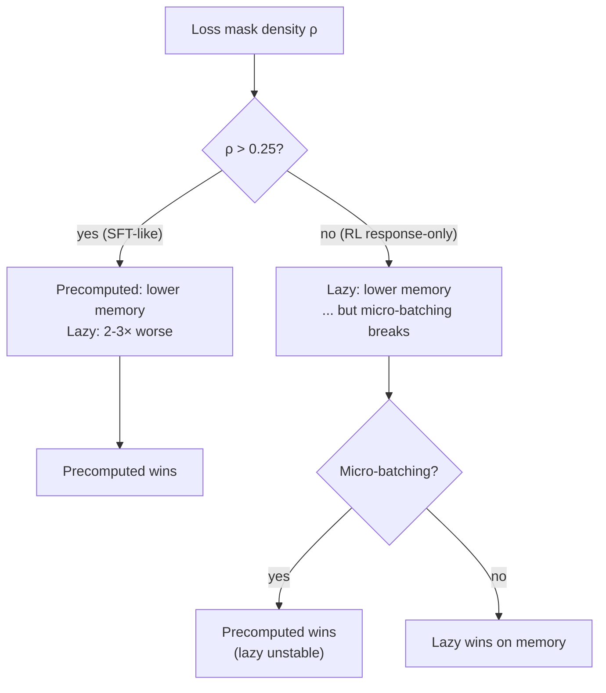

# LazyTarget vs Precomputed Memory Analysis

> [!summary] TL;DR
> `compiled_forward_kl_loss_from_hs` (the `LazyTarget` path) only saves memory vs `compiled_forward_kl_loss` (the `PrecomputedTarget` path) when the loss-mask density is below ~`V_draft / V_full ≈ 25%`. For typical SFT-style training with full-sequence loss, lazy uses **2-3× more memory** than precomputed because it allocates `(N, V_full)` tensors per step. Combined with FSDP micro-batching instability, the operating regime where lazy is genuinely useful is essentially empty — deletion is justified.

> [!info] Source files (verl)
> - Loss kernels: `recipe/drafter_cotraining/eagle3/ops/loss.py`
> - Target builders + dispatch: `recipe/drafter_cotraining/eagle3/eagle3_model.py`
> - Worker wiring: `recipe/drafter_cotraining/engine_workers.py`

---

## What `valid_idx` actually does

`valid_idx` is the int64 vector of flat positions where `loss_mask == 1`, length `N = N_valid`. Inside both compiled kernels (`ops/loss.py:47-48` for precomputed, `:87-88` for lazy):

```python
hs  = prenorm_hidden_states_flat.index_select(0, valid_idx)   # (B*T, H) → (N, H)
ths = target_hidden_states_flat.index_select(0, valid_idx)    # (B*T, H) → (N, H)
```

The gather happens **before** any matmul. Three things this buys:

1. **Sizes the V-projection at N, not B·T.** In `_from_hs`, the `(N, V_full)` allocation is what makes the kernel feasible without OOM. Without `index_select`, the per-step transient would be `B·T·V_full·{2,4} B` — for `B=1, T=8192, V=128k`, that's a 4 GB tensor allocated `length` times.
2. **Fusion under `torch.compile`.** Doing the gather *inside* the compiled region lets the fuser emit a single `gather → matmul → softmax → KL` kernel without round-tripping `(B*T, V)` through HBM.
3. **Stable across micro-batches.** `torch._dynamo.mark_dynamic(valid_idx, 0)` (`eagle3_model.py:115`) makes `N` symbolic so the compiler doesn't recompile every micro-batch when token counts shift.

> [!note] Without `valid_idx`, lazy isn't an option at all
> The whole reason `_from_hs` was written is to take the full-vocab projection but bound its memory by `N` instead of `B·T`. `valid_idx` is the load-bearing trick.

---

## Memory accounting

**Setup:** `B=1`, `T=8192`, `length=7`, `V_full=128k`, `V_draft=32k`, `H=4096`. bf16 weights, fp32 softmax.

### Precomputed path (`compiled_forward_kl_loss`)

| Tensor | Lifetime | Size |
|---|---|---|
| `target_p_padded` (fp32) | **resident**, persistent across all `length` steps | `(1, 8199, 32000)` × 4 B = **1049 MB** |
| `hs` per step (bf16) | transient | `(N, 4096)` × 2 B |
| `logits = F.linear(norm_hs, lm_head)` (fp32) | transient | `(N, 32000)` × 4 B |
| `log_p` (fp32) | transient | `(N, 32000)` × 4 B |

- **Per-step transient peak** ≈ `2 · N · V_draft · 4 B`
- **Total peak** ≈ resident + per-step transient (only one step in flight)

### Lazy path (`compiled_forward_kl_loss_from_hs`)

| Tensor | Lifetime | Size |
|---|---|---|
| `target_hidden_states_padded` (bf16) | resident | `(1, 8199, 4096)` × 2 B = **67 MB** |
| `hs`, `ths` per step (bf16) | transient | `2 × (N, 4096)` × 2 B |
| `target_logits = F.linear(ths, target_lm_head_weight)` (bf16) | transient | `(N, V_full)` × 2 B |
| `.float()` upcast | transient | `(N, V_full)` × 4 B |
| `tp = softmax(...)` (fp32) | transient | `(N, V_full)` × 4 B |
| `draft_logits` (bf16) → `log_p` (fp32) | transient | `(N, V_draft)` × {2,4} B |

- **Per-step transient peak** dominated by 2 × `(N, V_full) × 4 B` for the fp32 upcast and softmax → `8 · N · V_full` bytes per step
- **Total peak** ≈ per-step transient (resident HS tensor is tiny)

> [!warning] The fp32 softmax doubles the lazy peak
> Both `target_logits.float()` and `softmax(...)` materialize `(N, V_full)` in fp32. Even if the compiler fuses them, you still pay one `(N, V_full) × 4 B` allocation. At V_full=128k, this is the dominant cost.

---

## Concrete numbers

Plugging in `V_full=128k`, `V_draft=32k` (4× ratio):

| Mask density ρ | N (= ρ · 8192) | Precomputed peak | Lazy peak | Winner |
|---|---|---|---|---|
| 1.0 (full-seq) | 8192 | 1049 MB resident + ~2.1 GB transient = **~3.1 GB** | ~8.4 GB transient | Precomputed by 2.7× |
| 0.5 | 4096 | ~2.1 GB | ~4.2 GB | Precomputed by 2× |
| 0.25 | 2048 | ~1.6 GB | ~2.1 GB | Precomputed by 1.3× |
| **0.1** (RL response-only) | 820 | ~1.3 GB | ~840 MB | **Lazy by 1.5×** |
| 0.05 | 410 | ~1.2 GB | ~420 MB | Lazy by 2.9× |

### Crossover formula

```
ρ · V_full ≈ V_draft   ⇒   ρ_crossover ≈ V_draft / V_full
```

For `V_draft=32k`, `V_full=128k`: **crossover at ρ ≈ 0.25**.

> [!tip] Why precomputed scales better at high ρ
> Precomputed is `V_draft`-bounded across the whole training shape. Lazy is `ρ · V_full`-bounded. The lazy path only "wins" by being sparse enough to undercut V_draft — but at high ρ it gets crushed by the V_full factor.

---

## Operating regimes



| Regime | Precomputed | Lazy |
|---|---|---|
| **High ρ (>0.25)** | ✅ Lower memory **and** stable | ❌ More memory **and** unstable under micro-batching |
| **Low ρ (<0.25), no micro-batching** | OK | ✅ Genuine memory win |
| **Low ρ + micro-batching** | ✅ Stable | ❌ Gradient size mismatches under FSDP |

---

## Why lazy breaks under micro-batching

Three structural reasons (see [[Eagle3 Comparison — speculators vs TorchSpec]] for context on why precomputed sidesteps these):

1. **`target_lm_head_weight` lives inside the compile graph.** If it carries any (even accidental) `requires_grad=True` lineage or is a sharded `DTensor`, the compiled function treats it as a graph input needing gradient tracking across micro-batches. After the first backward, FSDP has reduce-scattered the actor's `lm_head`; the second micro-batch's backward sees a different effective shape → grad size mismatch.
2. **Two `valid_idx`-dependent matmuls per call.** `mark_dynamic` only marks `valid_idx` itself; downstream activation shapes `(N, V_full)` and `(N, V_draft)` change each micro-batch, and the compiler can pin one and recompile/error on the next.
3. **Target softmax in the autograd graph.** Even though `target_lm_head_weight` shouldn't propagate gradients, `torch.compile` doesn't always honor that without explicit `.detach()` inside the compiled region.

The precomputed path avoids all three: targets are built once outside the compiled region, fully detached, fp32, and sliced per step. The compiled kernel only sees `(hs, target_p, valid_idx, …)` where `target_p` has no grad lineage.

---

## bf16 storage as a mitigation

If `(B, T+length, V_draft)` ever gets uncomfortable on the precomputed path, the cheap fix doesn't require bringing back `_from_hs`:

```python
# eagle3_model.py:287 — change:
target_p = F.softmax(target_logits_pruned.float(), dim=-1)
# to:
target_p = F.softmax(target_logits_pruned.float(), dim=-1).to(torch.bfloat16)
```

The compiled kernel's `tp * log_p` (where `log_p` is fp32) auto-upcasts `tp`, so loss arithmetic stays fp32. Halves the resident `target_p_padded` size at any ρ:

| ρ | Precomputed (fp32 stored) | Precomputed (bf16 stored) | Lazy |
|---|---|---|---|
| 1.0 | 3.1 GB | **1.6 GB** | 8.4 GB |
| 0.5 | 2.1 GB | **1.1 GB** | 4.2 GB |
| 0.1 | 1.3 GB | **0.8 GB** | 0.8 GB |

With bf16 storage, precomputed matches lazy even at the lazy-favoring ρ=0.1 regime.

---

## Practical implication

Combined with the FSDP micro-batching instability, the case for `_from_hs` is narrower than it looks:

- **High ρ (>0.25):** lazy is more memory **and** unstable. Precomputed strictly dominates.
- **Low ρ (<0.25):** lazy saves memory, but micro-batching breaks it under FSDP gradient accumulation, so you can't actually use the savings.
- **Low ρ + no micro-batching:** the only regime lazy is genuinely useful — and bf16-target storage on precomputed closes the gap.

> [!quote] Bottom line
> There is essentially no operating point where `_from_hs` is both **correct** under verl's FSDP micro-batching path **and** the better choice on memory. Deletion of the `LazyTarget` branch + `compiled_forward_kl_loss_from_hs` simplifies the model dispatch and removes a footgun.

### What to delete

- `compiled_forward_kl_loss_from_hs` in `recipe/drafter_cotraining/eagle3/ops/loss.py`
- `LazyTarget` dataclass + `compute_lazy_target_padded` factory in `recipe/drafter_cotraining/eagle3/eagle3_model.py`
- The `isinstance(target, PrecomputedTarget)` dispatch in `_calculate_loss` (collapses to one path)
- `_target_lm_head_weight` plumbing in `recipe/drafter_cotraining/drafter_engine.py:185`
- The `LazyTarget` test path in `recipe/drafter_cotraining/tests/test_eagle3_loss.py`

---

## Related

- [[Eagle3 Implementation (speculators repo)]]
- [[Eagle3 Comparison — speculators vs TorchSpec]]
- [[FSDP Sharding in Speculators]]
